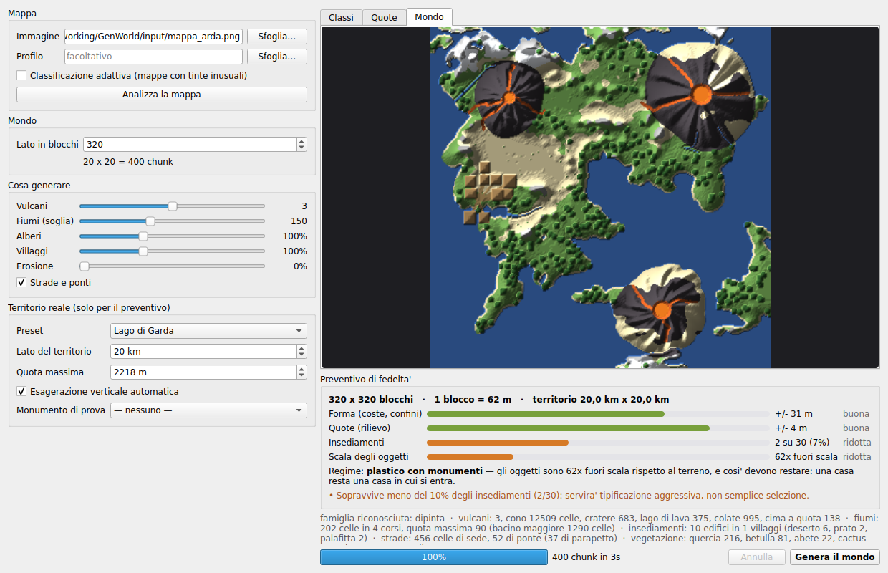

# GenWorld

Generatore di mondi Minecraft (Java Edition) a partire da piante, disegni,
heightmap e dati geografici reali.

Stato: **funziona e si gioca.** Da un'immagine disegnata si ottiene un mondo
Minecraft giocabile - terreno, fiumi, vulcani, biomi, vegetazione, citta' con
mura e mercato, botteghe con gli artigiani dentro, campi coltivati, strade e
ponti - aperto e provato in gioco sulla 1.21.4. C'e' anche la finestra.

## L'idea in una riga

La scala del **terreno** e la scala degli **oggetti** sono indipendenti. Il
terreno si comprime per far stare un territorio grande in pochi blocchi; case,
ponti e monumenti restano a dimensione giocabile. Il rapporto fra le due e' il
**fattore di esagerazione**, e da li' discende tutto il resto.

Niente case mignon: il generatore di edifici non ha accesso alla scala del
terreno, quindi non puo' sbagliare.

## Licenza

Nessuna, per ora: il codice e' visibile ma tutti i diritti sono riservati.
Se ti serve riusarlo, chiedi.

## Installazione

Doppio clic su `GenWorld.bat`: al primo avvio si costruisce l'ambiente da
solo. Il resto di questa sezione serve solo se qualcosa va storto.

### La versione di Python conta: dalla 3.10 alla 3.12

Non la 3.13, non la 3.14. Il motivo e' una catena di due anelli:
`amulet-core` richiede `numpy` della serie 1, e l'ultimo numpy della serie 1
(1.26.4) ha i pacchetti gia' compilati fino a Python 3.12. Con un Python piu'
nuovo pip non trova il pacchetto pronto, prova a compilare numpy dai
sorgenti, cerca il compilatore di Visual Studio, non lo trova e si ferma con

```
ERROR: Unknown compiler(s): [['icl'], ['cl'], ['cc'], ['gcc'], ...]
```

che sembra un problema di GenWorld e non lo e'. `GenWorld.bat` cerca da solo
un 3.12, 3.11, 3.10 o 3.9 fra quelli installati, e se non ne trova nessuno lo
dice invece di far partire una compilazione destinata a fallire. Le versioni
convivono: si puo' tenere anche il Python nuovo per tutto il resto.

Se l'ambiente e' gia' stato creato con un interprete troppo nuovo,
`GenWorld.bat` se ne accorge e lo rifa' da capo.

### A mano

Lo **stimatore di fedelta'** non ha dipendenze: basta Python 3.10+.

Per **scrivere mondi** serve `amulet-core`, che rompe altri pacchetti se
installato nell'ambiente di sistema. Va in un venv dedicato, **fuori dalla
cartella Google Drive** (un venv sono migliaia di file e li sincronizzerebbe
tutti):

```bat
py -3.12 -m venv C:\venvs\genworld
C:\venvs\genworld\Scripts\pip install "numpy<2"
C:\venvs\genworld\Scripts\pip install amulet-core pillow scipy PySide6-Essentials
```

Poi si lancia con quell'interprete:

```bat
C:\venvs\genworld\Scripts\python esempi\spike_piatto.py
```

## Uso

### La finestra

Doppio clic su **`GenWorld.bat`**, nella cartella del progetto.

Al primo avvio crea l'ambiente in `C:\venvs\genworld` e installa le
dipendenze (qualche minuto, una volta sola); dalle volte dopo parte e basta.
Controlla anche che numpy sia rimasto alla serie 1: amulet non regge la 2, e
un pacchetto presente ma rotto non si vede guardando l'elenco di pip.

Equivale a:

```bat
C:\venvs\genworld\Scripts\python -m genworld.gui
```

Un vero `.exe` si puo' costruire solo su Windows, quindi in cartella c'e' la
ricetta invece del risultato: **`crea_exe.bat`** lo impacchetta con
PyInstaller. E' sperimentale - amulet si porta dietro i dati di PyMCTranslate,
che PyInstaller tende a lasciare indietro - e il `.bat` resta la strada che
funziona sempre.



E' il punto da cui il progetto era partito: "un applicativo per pc". A
sinistra la mappa, il lato in blocchi e i cursori di cosa generare; a destra
l'anteprima (classi, quote dedotte, mondo finito) e il **preventivo di
fedelta' che si ricalcola mentre si trascinano i cursori**.

Il preventivo e' un preventivo, non un voto: una riga per dimensione, perche'
un numero unico nasconderebbe proprio la cosa che interessa, *cosa* si perde.
E non c'e' nessun controllo per la scala degli oggetti, che resta 1 m per
blocco: il cursore muove la scala del **terreno**, e il pannello mostra il
fattore di esagerazione che ne risulta. Una casa resta una casa in cui si
entra anche su un mondo da 256 blocchi.

La generazione gira in un thread: la barra avanza, il bottone Annulla
funziona, e chiudere la finestra a meta' lavoro non lascia un mondo monco.

### Stimatore di fedelta'

```bash
python -m genworld.cli stima --preset garda --lato 2048 --auto-verticale
python -m genworld.cli confronta --preset italia --auto-verticale
python -m genworld.cli risolvi --preset italia --errore 500        # fisso la fedelta'
python -m genworld.cli risolvi --preset garda --metri-per-blocco 1 # fisso la scala
python -m genworld.cli risolvi --preset italia --lato 1000         # fisso il mondo
```

Preset: `italia`, `garda`, `valorcia`, `etna`.
Monumenti: `torre_eiffel`, `colosseo`, `duomo_milano`, `torre_pisa`, `mole`,
`burj_khalifa`.

### Calibrare la lettura di una mappa

Su cinque mappe reali di stili diversi la classificazione automatica funziona su
due e fallisce su due. I modi di fallire non sono tarature da aggiustare: sono
cose che una persona vede in un secondo e un algoritmo no - una cornice
illustrata, un riquadro di legenda, un mare dipinto del colore della terra.

Quindi si chiedono due gesti, con lo strumento **Calibratore Mappe** (pagina web,
l'immagine resta nel browser):

1. un **rettangolo** attorno alla mappa vera - elimina cornici, legende,
   cartigli e rose dei venti in un colpo solo;
2. qualche **clic col contagocce** - "questo e' mare, questo e' montagna,
   questo e' decorazione da ignorare";
3. se serve, qualche **pennellata** terra/acqua - la via di fuga per le mappe
   che nessuna regola sa leggere.

Le pennellate decidono solo l'appartenenza a terra o acqua, non la classe:
dove concordano col colore resta il dettaglio della classificazione. Viaggiano
dentro il JSON del profilo come maschera 192x192 compressa a lunghezze di corsa
(~1,5 KB), quindi non c'e' un file a parte da tenere allineato.

Si copia il profilo JSON, si salva accanto alla mappa e si genera:

```bash
python esempi/genera_mappa.py --profilo input/ansalon.profilo.json --lato 832 --lotto 0
```

Misurato su cinque mappe reali di stili diversi: **da due su cinque a quattro
su cinque**. Su Ansalon (seppia con cornice illustrata, il caso peggiore)
l'acqua passa dall'**1,5% al 46,7%** e il decoro viene azzerato dal rettangolo,
ma la geografia resta imprecisa: li' serve il pennello.

Effetto collaterale utile: ritagliata la cornice, anche `famiglia()` smette di
sbagliare - la cornice illustrata gonfiava la grana e faceva passare una mappa
dipinta per fotografica.

### Da una mappa disegnata a un mondo

```bash
# una mappa grande si genera a lotti: il lotto 0 crea, i successivi aggiungono
python esempi/genera_mappa.py --lato 832 --lotto 0 --chunk-per-lotto 700
python esempi/genera_mappa.py --lotto 1 --chunk-per-lotto 700
python esempi/genera_mappa.py --lotto 2 --chunk-per-lotto 700
python esempi/genera_mappa.py --lotto 3 --chunk-per-lotto 700
python esempi/genera_mappa.py --anteprima
```

Produce `mondi/arda/` (832x832 blocchi, 2704 chunk, 11 MB) e
`mondi/arda_anteprima.png`. Senza `--chunk-per-lotto` fa tutto in una volta.

La pipeline vera sta in `genworld/motore.py`: `esempi/genera_mappa.py` e la
finestra sono due interfacce sopra le stesse funzioni (`analizza`,
`pianifica`, `scrivi`), cosi' non possono divergere.

Opzioni principali:

```
--profilo FILE     profilo del Calibratore (rettangolo + campioni + pennello)
--fiumi SOGLIA     area drenata minima per un fiume (150; 0 = nessuno)
--alberi SCALA     densita' della vegetazione (1,0; 0 = nessuna)
--villaggi SCALA   densita' degli insediamenti (1,0; 0 = nessuno)
--erosione GOCCE   erosione idraulica (0 = spenta; utile sui terreni lisci)
--vulcani N        quanti coni vulcanici piazzare (3; 0 = nessuno)
--senza-strade     non tracciare la rete stradale
```

Su Arda: 3 vulcani (19.418 celle di cono, 767 di cratere, 423 di lago di lava,
1.114 di colata, cima a quota 143), 1.363 celle di fiume in 26 corsi, ~3.800
alberi, 91 edifici in 5 centri (3 murati), 3.811 celle di sede stradale di cui
2.122 lastricate, e 164 di ponte.

I ponti non si piazzano: emergono. Ogni tratto di strada che finisce sull'acqua
o su un avvallamento profondo diventa ponte, perche' e' l'unico modo di stare
alla quota della sede. Uno di quelli su Arda attraversa uno stretto per 116
celle - nessuno l'ha chiesto, la strada doveva arrivare a quel villaggio.

L'ordine della pianificazione non e' negoziabile, perche' tre fasi modificano
il terreno: insediamenti (spianano i lotti), strade (spianano la sede),
vegetazione (si semina su quel che resta). Nella scrittura di ogni chunk:
terreno, alberi, edifici, strade.

Quattro trappole delle mappe dipinte, tutte risolte in `genworld/mappa.py` e
documentate nei doc di progetto: l'ombreggiatura dentro i colori (si classifica
in HSV sulla tinta), la stessa ombreggiatura come segnale (contrasto locale =
rilievo), le scritte che diventano montagne a forma di parola (maschera **e**
rugosita' azzerata), il bordo dell'immagine che diventa una muraglia (ritaglio
**e** margine azzerato).

### Generazione di un mondo di prova

```bash
python esempi/spike_piatto.py
```

Produce `mondi/spike/` (mondo Minecraft 256x256) e `mondi/spike_anteprima.png`.
Con `--liscio` genera la variante senza rumore, per confronto.

Per provarlo in gioco, copiare la cartella `mondi/spike` dentro
`%APPDATA%\.minecraft\saves\`.

### Test

Per lavorare sul codice servono anche pytest, coverage e ruff, che
`GenWorld.bat` non installa:

```bat
C:\venvs\genworld\Scripts\pip install -r requirements-dev.txt
C:\venvs\genworld\Scripts\python -m pytest tests -q          # circa 600 test, un minuto e mezzo
C:\venvs\genworld\Scripts\ruff check genworld esempi tests   # configurazione in pyproject.toml
C:\venvs\genworld\Scripts\python -m coverage run -m pytest tests -q
C:\venvs\genworld\Scripts\python -m coverage report
```

Col solo Python di sistema i test che richiedono amulet (scrittura dei mondi)
o PySide6 (la finestra) vengono saltati. Su un clone pulito ne saltano di piu':
i template delle case non stanno nel repository (sono file di altri), e senza
`templates/strutture` i villaggi escono senza case - la finestra lo avvisa
prima di generare. L'aspetto della finestra non si prova con un
test: si guarda, e per guardarlo senza schermo c'e'
`python esempi/scatto_gui.py --analizza`, che la disegna offscreen e la
fotografa in `mondi/gui.png`.

## Cosa ha trovato lo spike

**amulet-core scrive i file region correttamente ma produce un `level.dat`
monco**: contiene solo `DataVersion`, `LastPlayed`, `LevelName` e `version`.
Mancano `WorldGenSettings`, `GameType`, `Version`, lo spawn e i gamerule, e
all'apertura amulet stesso segnala che i template delle dimensioni sono
malformati. Minecraft rifiuterebbe il mondo o lo rigenererebbe.

Soluzione: `genworld/livello_dat.py` ricostruisce il `level.dat` da zero dopo
la creazione, con `verifica()` che controlla la presenza e il tipo di tutti i
campi che Minecraft legge all'apertura.

Scelta collegata: l'overworld e' un **superflat di sola aria**. Il terreno lo
scriviamo noi, e cosi' i chunk che non tocchiamo restano vuoti invece di
riempirsi di terreno vanilla a caso ai bordi della mappa.

**Trappola del renderer**: il palette dei blocchi di un livello amulet e' vuoto
appena caricato e si popola solo man mano che si leggono i chunk. Costruire la
mappa colori prima del ciclo da' un'immagine tutta ignota. Va risolto
pigramente, dentro il ciclo.

**DataVersion: non scriverla a mano.** Una tabella compilata a memoria aveva
gia' due valori sbagliati di un'unita' (1.21.5 e 1.21.8). Ora
`data_version_di()` la chiede a PyMCTranslate, che arriva con amulet ed e' la
fonte autorevole.

## Il terrazzamento

Aperto il mondo in gioco, il versante mostrava curve di livello a gradini. Non
e' un difetto del rilievo: e' un artefatto della **quantizzazione** a blocchi
interi, e una superficie liscia che attraversa lentamente il confine fra due
interi lo attraversa lungo una curva di livello.

Sommare fBm prima di arrotondare non basta: le ottave fini portano
un'ampiezza `persistenza^n`, cioe' centesimi di blocco, mentre serve
variazione dell'ordine del blocco proprio alle frequenze alte.

La soluzione e' ditherare la soglia di arrotondamento (`rumore.quantizza`):
costa 0,03 blocchi di scarto medio e i gradini spariscono. Confronto visivo in
`mondi/confronto_terrazze.png`.

Nota: quattro metriche automatiche di terrazzamento sono state provate e
scartate, nessuna discrimina. Dettagli in `genworld/rumore.py`.

## Verifica

Lo spike non e' "sembra giusto": 256x256 blocchi generati, riletti dai file
region e confrontati colonna per colonna con la heightmap di partenza.

```
colonne confrontate: 65536
differenze diverse da zero: 0
errore max: 0
```

Resta un solo passaggio che qui non si puo' fare: aprire il mondo in Minecraft.
La struttura del `level.dat` e' validata campo per campo, ma la prova definitiva
e' il doppio clic.

## I vulcani e la ruota con i raggi

Il cono e' l'unico elemento che si **sovrappone** al terreno invece di
dedurlo: si somma alla heightmap con `np.maximum`, cosi' un vulcano su una
collina ne eredita la base. Il profilo e' concavo verso l'alto
(`1 - t**1.5`), il cratere e' un invaso con il fondo piatto e la lava sta al
suo livello, non a quello del mare.

Il primo risultato era geometricamente corretto e visivamente falso: le colate
scendevano come i raggi di una ruota. Un cono matematicamente perfetto ha il
gradiente **esattamente radiale**, quindi la massima pendenza e' la linea
retta dal cratere.

Il primo rimedio - un fBm planare sommato al cono - non ha cambiato nulla:
con celle piu' larghe del cono il rumore lo **inclina** soltanto. Il rumore
deve essere **angolare**: la quota dipende dall'angolo attorno al cratere,
cosi' le pieghe corrono lungo la linea di massima pendenza e diventano
valloni. Sopra ci vanno altre due correzioni, perche' tre armoniche pure
danno una zucca scanalata: un'onda lenta che apre alcuni settori e ne
appiattisce altri, e un fBm fine che sporca i crinali. Il raggio stesso e'
deformato del 10% da tre onde lente, altrimenti la base e' un cerchio di
compasso.

Valore scelto `rugosita = 0,18`, dal confronto in `mondi/vulcani.png`
(`python esempi/prova_vulcani.py 0 0.12 0.18 0.26`).

Difetto collegato, trovato dallo stesso confronto: senza una soglia di
pendenza l'inerzia della colata tirava righe rette per mezza mappa, perche' in
pianura il gradiente e' nullo e nulla la frena. Ora la lava si ferma dove il
pendio si spiana - si raffredda, non arriva al mare.

E un bug vero, scoperto da un test: in `scegli_siti` un sito scartato perche'
troppo vicino al bordo consumava comunque uno dei vulcani richiesti, e su una
mappa con poca terra utile se ne otteneva **zero**.

## I biomi, ovvero il clima

Per molto tempo il mondo ha avuto i blocchi giusti e nessun clima: ogni chunk
usciva `plains`. In gioco vuol dire erba dello stesso verde dal deserto alla
tundra, acqua di un colore solo, niente neve che si posa, mob sbagliati. I
biomi sono l'unica cosa che Minecraft **non** deduce dai blocchi.

Il clima si calcola, non si dichiara: un campo di "freddo" da 0 a 1, tagliato
in tre fasce. Due contributi:

- la **quota**, che e' il contributo certo - l'aria si raffredda salendo e la
  heightmap ce l'abbiamo;
- la **latitudine**, ma solo se il disegno la suggerisce. Una mappa disegnata
  non dice dove sia il nord, percio' invece di inventare un asse si guarda
  dove sta la classe NEVE: se e' concentrata da una parte, quella parte e' il
  freddo. Se e' al centro non e' latitudine, e' quota; se non c'e', nessun
  gradiente.

Sopra a tutto un fBm largo, perche' una soglia netta segue una curva di
livello e un confine di bioma che segue una curva di livello si riconosce a
colpo d'occhio come generato.

Due errori, uno di misura e uno di lettura.

**La latitudine andava centrata.** Presa cosi' com'e', da 0 a 1, metteva
meta' mappa sotto la soglia del caldo: l'oceano tropicale diventava il bioma
piu' esteso del mondo, 154.615 celle su Arda, piu' dell'oceano normale. Un
emisfero intero non puo' essere "l'estremo caldo". Ora e' uno scostamento da
un clima temperato.

**Un nome moderno non e' un nome universale.** `universal_minecraft:snowy_plains`
non esiste - l'universale e' `snowy_tundra` - e `from_universal` su un nome
sconosciuto lo restituisce tale e quale, senza un errore. E' esattamente la
trappola di `universal_minecraft:oak_log`, la seconda volta. Stavolta pero'
c'e' una guardia: `biomi.verifica_traduzioni()` prova tutta la tavolozza
contro PyMCTranslate, e un test la chiama.

Verifica finale con il metodo dello spike: mondo generato, file region
riaperti, biomi riletti e confrontati con la mappa che li ha prodotti. Zero
differenze. Su Arda: 27 biomi distinti, `mondi/biomi.png` mette a confronto
le classi e i biomi.

## Il difetto che solo il gioco poteva mostrare

Aperto il mondo in Minecraft 1.21.4: terreno giusto, alberi giusti, biomi
giusti - e in sovrimpressione, a ripetizione:

    Caricamento del chunk in [-11, -6] non riuscito
    Controlla il registro per ulteriori dettagli

Nel registro, 1.193 volte in una partita:

    Failed to parse chunk [x, z] position info
    java.lang.ArrayIndexOutOfBoundsException: Index 0 out of bounds for length 0
    Failed to load chunk x,z

Non erano i file region. Quelli erano stati riletti e confrontati piu' volte
- colonna per colonna per le quote, cella per cella per i biomi - ed erano a
posto. Era la cartella **`entities/`**, che amulet scrive accanto a
`region/`: per ogni chunk un chunk-entita' di 22 byte contenente solo
`DataVersion: 0`, senza `Position` e senza `Entities`. Minecraft legge la
posizione da quell'array, trova un array vuoto, e va fuori indice.

I due archivi sono separati, quindi il terreno si caricava lo stesso: il
difetto era invisibile a tutto quello che avevamo controllato, perche'
avevamo controllato solo la meta' a cui stavamo pensando.

I nostri mondi non contengono entita', quindi la cartella giusta e' nessuna
cartella: `ScrittoreMondo` la elimina alla chiusura e Minecraft la ricrea
quando serve. Il mondo passa da 22 a 11 MB.

Nello stesso registro, un secondo avviso minore: `key missing: DragonFight`.
Minecraft lo cerca nel level.dat anche se l'End non l'hai mai visto. Ora c'e'.

`tests/test_mondo_valido.py` rilegge i file **senza passare da amulet** - un
controllo fatto con lo stesso strumento che ha scritto il file non e' un
controllo - e pretende quello che pretende Minecraft: `xPos`, `zPos`, `yPos`,
`Status`, `sections`, `Heightmaps` in ogni chunk, `Position` in ogni
chunk-entita' se la cartella esiste, e un level.dat senza lamentele.

## Le citta'

Prima un "villaggio" era una maglia organica di strade (punti sparsi,
triangolati) con case buttate dentro. Dall'alto si riconosceva subito, e in
gioco - parole di chi le guardava - le citta' erano "incasinate e non
ordinate". Ora la pianta e' **regolare** e, soprattutto, **il terreno si adatta
alla citta', non il contrario**.

**La pianta.** Un quadrato, con due assi larghi tre celle che si incrociano
in una piazza di 11x11, e nelle citta' una via di circonvallazione a ridosso
della cinta. L'isolato che gli assi e la circonvallazione lasciano libero in
ogni quadrante e' diviso in quattro lotti (tre in un villaggio: il quarto non
toccherebbe nessuna strada), separati da due celle, ognuno con la facciata
verso la sua strada. Una citta' ha 16 lotti, un villaggio 12. Lotti e
catalogo: la misura del lotto parte dai modelli scaricati (con 16x16 e la
gronda entrano 20 modelli diversi su 40, con 13x13 solo 10) e non dall'avanzo
dell'isolato, che era il motivo per cui in tanti lotti non entrava niente.

**Le mura.** Cinta quadrata di tre celle di spessore, quattro porte (una per
asse), torri agli angoli, accanto alle porte e a meta' di ogni lato. Fuori
dalla cinta una berma, poi il **fosso** (tre celle, tre blocchi di profondita',
acqua due sotto il bordo) e un argine. Gli assi escono dalle porte,
attraversano il fosso e li' diventano **ponte**: le strade fra gli abitati
partono da quattro punti in campagna, oltre il fosso.

**Il terreno si piega alla citta'.** Dove la pianta passa sopra un fiume, un
laghetto o una collina, il terreno viene spianato a una quota sola (la
mediana) e il fiume sparisce sotto la citta'; attorno la piana sfuma nel
terreno vero in dieci celle, senza gradini. `citta.pianifica` restituisce anche
le copie di `cls` e `livello` con questi cambiamenti, e il resto della
pipeline (strade, campi, scrittura) legge quelle, non le originali.

**Il posto si cerca.** I siti sono scelti vicino all'acqua, quindi spesso a
ridosso di una costa. Prima di scartarne uno lo si prova a spostare (fino a 60
celle) e si sceglie il punto con meno mare e meno dislivello; si scarta se
dentro la piana c'e' piu' del 12% di mare, un vulcano, un dislivello da
montagna o un'altra citta'. Se la citta' non trova posto prova una misura
minore e poi un villaggio senza mura.

**Mai un abitato di due case.** Un sito che produce meno di quattro lotti si
scarta per intero, senza lasciare piana ne' fosso (si lavora su copie e si
accetta solo alla fine). Sulle mappe grandi i lotti sono comunque 12 o 16.

**Il mercato** sta agli angoli della piazza, fuori dagli assi, rivolto al
centro: quattro banchi in una citta', due in un villaggio, nessuno in un
borgo piccolo.

**I tetti.** Il sedime di due case adiacenti non si tocca mai, e fra due
lotti ci sono due celle di stacco: il tetto sporge di un blocco oltre i muri e
due gronde non si devono incontrare.

**Dentro le case** c'e' qualcosa: letto lontano dalla porta, focolare e banco
contro il muro, cassa, scala a pioli sotto il buco nel solaio, torce.

## Mestieri, botteghe e abitanti

Una citta' di sole case e' un dormitorio. Ogni edificio ora puo' avere un
**mestiere**, dedotto da dove sta: le botteghe sulla piazza e sulle vie
principali (libraio, speziale, cartografo, macellaio, fruttivendolo, fabbro),
gli artigiani rumorosi un po' piu' in la' (armaiolo, corazzaio, falegname,
scalpellino, conciatore), e chi lavora la terra o il pesce al bordo, vicino a
quello che lavora. E' la ragione per cui i mestieri hanno dato i nomi alle vie
di mezza Europa.

Dentro, ogni bottega ha il suo banco - incudine e fucina dal fabbro,
affumicatore dal macellaio, compostiera e ceste dal fruttivendolo, telaio dal
pastore - e il banco non e' decorazione: in Minecraft e' il "posto di lavoro"
che un abitante rivendica.

Sulla piazza si apre il **mercato**: banchi 3x3 con quattro pali, la tenda
colorata e il bancone rivolto verso la piazza, con la merce sopra. Frutta,
carne, pesce, verdura.

### Gli abitanti, e il secondo file che amulet scrive male

Nelle case e dietro i banchi ci sono i villager. Metterceli ha richiesto di
scrivere a mano i file `entities/*.mca`: **amulet non serializza le entita'**.
Si puo' riempire `chunk.entities` di oggetti perfettamente formati e quello
che finisce sul disco resta il solito chunk da 22 byte con dentro
`DataVersion: 0` - lo stesso file che faceva scorrere all'infinito
"Caricamento del chunk non riuscito".

Quindi `genworld/entita.py` scrive il formato Anvil da zero: intestazione da
8 KiB, settori da 4096 byte, NBT compresso con zlib, e dentro `Position` ed
`Entities` come li vuole Minecraft. E' la seconda volta che tocca rifare cio'
che amulet scrive male - la prima era il `level.dat`.

Difetto trovato subito dopo, e istruttivo: i primi abitanti sono finiti nelle
regioni `r.0.0`/`r.1.1` invece di `r.-1.-1`/`r.0.0`. Tutta la pianificazione
lavora in coordinate di **mappa** (0..lato), il mondo e' centrato
sull'origine, e i blocchi lo sanno perche' glielo dice chi li scrive; le
entita' no. Nessun errore, nessun avviso: trentadue abitanti scritti in un
angolo di mondo vuoto.

Su Arda: 94 edifici, 32 botteghe, 12 banchi di mercato, 44 abitanti.

## La campagna

Un paese senza campi e' un fondale: le botteghe vendevano frutta e carne e
attorno alle mura c'era il bosco fino al fossato.

Il **podere** e' un rettangolo arato con un canale d'acqua nel mezzo, e la
sua forma non e' una scelta estetica: in Minecraft la terra arata resta
bagnata solo entro quattro blocchi dall'acqua, altrimenti si secca e torna
terra. Un campo largo nove con il canale in mezzo e' bagnato tutto, uno largo
undici no. La forma DISCENDE dalla regola, come i ponti discendevano dalla
quota della strada. I poderi si spianano, come i lotti delle case.

Il **frutteto** e' a filari su un reticolo con un po' di disordine, chiuso
dal recinto. Il melo in Minecraft non esiste: e' la quercia, che le mele le
fa cadere davvero; il ciliegio invece c'e' dalla 1.20. Passo cinque e non
quattro, perche' la chioma di una latifoglia e' larga cinque blocchi e a
quattro di distanza i filari si saldano in un bosco unico.

Lungo i recinti, **siepi di bacche**.

Due difetti, trovati guardando:

* la coltura la sceglieva la singola cella e veniva fuori una scacchiera di
  grano, carote e patate dentro lo stesso campo. La coltura appartiene al
  podere, quindi ora sta nel codice della mappa - un valore per coltura -
  perche' il chunk, quando scrive i blocchi, non sa di quale podere sia la
  cella che ha davanti;
* le strade tagliavano dritto per i poderi. Nessuno lo aveva detto all'A*, e
  i campi sono la cosa piu' piana che ci sia: li avevamo appena spianati noi.
  Ora costano caro nella griglia di costo - caro, non vietato: una strada che
  deve passare di li' passa, e in campagna succede.

Su Arda: 26 poderi, 4 frutteti, 1.872 celle arate, 36 alberi da frutto, 350
cespugli di bacche, e zero celle di campo attraversate da una strada.

## Il fondale

Misurato su Arda prima di `batimetria.py`: il **53% di tutta l'acqua** stava a
esattamente y=54, un piano unico a otto blocchi di profondita' che copriva
meta' del mare; un altro 7% a y=30. Non erano un fondale, erano due terrazze, e
fra l'una e l'altra un muro - 2.836 celle con un salto di piu' di otto blocchi
in una cella sola, con punte di 67.

La causa era che la profondita' non si calcolava, si **tagliava**: l'altimetria
imponeva un tetto (-3 al mare, -12 all'oceano) e sotto non c'era niente che
generasse rilievo, quindi tutto si appiattiva contro il tetto. La profondita'
discendeva dalla CLASSE, e la rupe era il confine fra due classi.

Ora discende dalla **distanza dalla costa**, che e' quello che la determina
anche in mare vero, e ha tre regimi: piattaforma continentale dolce fino a una
decina di blocchi, scarpata ripida distesa su decine di celle invece che su
una, piana abissale profonda e quasi piatta. Il rilievo fBm cresce con la
profondita', cosi' le spiagge non diventano un terreno accidentato e al largo
ci sono dorsali e fosse.

Un dettaglio che conta: la distanza dalla costa, presa com'e', disegna anelli
concentrici attorno a ogni isolotto. Si deforma con un rumore largo - lo stesso
gesto del raggio deformato del cono vulcanico. Il difetto e' la regolarita',
non il rumore che manca.

Su Arda: profondita' media 11 blocchi, massima 48, 48 quote distinte, la piu'
diffusa copre il 14% dell'acqua. Zero muri al largo.

## Il sottosuolo, e il mondo che finiva a y=0

Censito sul mondo generato: il sottosuolo era **62% pietra e niente altro**.
Niente caverne, niente minerali, niente ardesia. Si scavava e si trovava pietra
fino alla bedrock, per sempre.

`sottosuolo.py` fa tre cose con tre meccaniche diverse. Le **caverne** sono
cunicoli, non bolle: si scavano con dei "vermi", cammini casuali in tre
dimensioni con inerzia e raggio variabile. Un rumore 3D darebbe caverne a
groviera, tutte uguali; un cunicolo si percorre. I **minerali** sono grumi
piccoli a fasce di quota, generati per chunk in modo deterministico - compresi
quelli dei chunk vicini, che sporgono qui: e' la stessa regola degli alberi,
filtrare per centro invece che per ingombro taglia a meta' tutto quello che sta
sul confine. L'**ardesia** e' una fascia, non una riga: sotto y=0 la pietra
diventa deepslate con una decina di blocchi di mescolanza.

La regola che tiene insieme tutto: non si scava mai sopra `terreno - 5`. Cinque
blocchi di cappello garantiscono che una caverna non sfondi il prato e,
soprattutto, che non apra un buco sotto il mare.

### E poi il modulo funzionava e il deepslate non c'era

Scritto il modulo, il censimento continuava a dire **zero ardesia**. I minerali
c'erano, le rocce c'erano, le caverne erano pianificate - 45.174 celle di
cunicolo fra y=-58 e y=63 - e sotto y=0 non c'era niente di niente.

Il colpevole non era `sottosuolo`. Era `mondo.py`. Il `level.dat` che scrive
amulet ha un `WorldGenSettings` che amulet **stesso** non sa rileggere
(`...["type"] was not a StringTag or CompoundTag`), e quando non lo sa rileggere
ripiega sui limiti di prima della 1.18: y da 0 a 256. Il livello si apriva con
quei limiti e nel salvataggio buttava via, senza dire niente, ogni sub-chunk
negativo. Spariva tutto: la bedrock a -64, l'ardesia, le caverne profonde, i
minerali del fondo.

E il controllo di andata e ritorno non se ne accorgeva, perche' alla chiusura il
`level.dat` lo riscriviamo noi, giusto, e da quel momento in poi rileggendo il
mondo i limiti tornavano corretti. In memoria i sub-chunk da -4 a -1 c'erano;
sul disco no; e chi rileggeva arrivava sempre dopo la riscrittura.

Il rimedio e' una riga spostata: il `level.dat` si scrive **prima** di aprire il
livello, non dopo averlo chiuso. Piu' un controllo esplicito all'apertura, che
si rifiuta di cominciare se il livello dichiara un y minimo sbagliato, e un test
che guarda quanto scende la pietra finita **sul disco**.

E' la terza volta che amulet scrive male qualcosa di essenziale - `level.dat`,
`entities/`, ora i limiti del mondo - e la morale e' sempre la stessa, gia'
scritta piu' su: rileggere quello che si e' scritto non basta, se si rilegge
solo la parte a cui si sta pensando.

Su Arda, adesso: 19,5% deepslate, ardesia, minerali profondi al loro posto, e
il 2,3% del sottosuolo sotto y=48 e' vuoto - sono le caverne.

## Le montagne a strati

Le montagne di Arda avevano due difetti, visti in gioco. Erano un blocco solo
dalla base alla cima - `stone` e basta - e la loro superficie era a righe
verticali, come un gelato alla crema.

Le righe erano **il dithering della quantizzazione applicato dove non serve**.
Il dithering cura le terrazze, e le terrazze esistono solo sui pendii dolci,
dove la superficie attraversa un intero ogni molte celle. Su un fianco che
scende di tre blocchi per cella di gradini non ce ne sono gia': li' il
dithering non toglie niente e aggiunge mezzo blocco di disturbo a ogni colonna.
Adesso la forza del dithering scende a zero oltre il blocco per cella: la cura
si applica al malato.

Il blocco solo e' `stratigrafia.py`. Una montagna vera e' fatta a strati, e due
proprieta' contano piu' di tutte. **Sono globali**: lo stesso banco di arenaria
si ritrova su due versanti opposti della stessa valle, alla stessa quota, ed e'
questo che fa leggere un paesaggio come un paesaggio invece che come rumore
colorato. Quindi la tavola degli strati e' una sola per tutta la mappa,
indicizzata dalla quota. E **non sono piatti**: si aggiunge uno scostamento per
colonna preso da un rumore largo, e nelle sezioni si vede la piega.

Poi due regole di superficie. Dove il pendio e' una parete non cresce niente -
niente erba, niente neve, solo roccia nuda: e' cosi' che si ottengono le pareti,
senza generarle, semplicemente non coprendole di erba. E la neve non comincia a
una quota netta: fra il limite inferiore e quello superiore e' a chiazze, col
manto sottile invece del blocco pieno, e la linea delle nevi si alza o si
abbassa di trenta blocchi col clima - senza, si imbiancano anche le montagne in
mezzo al deserto.

## Cinque difetti visti in gioco, e uno trovato cercandone un altro

Una passeggiata dentro Arda, e cinque cose che dall'alto non si vedevano.

**Il crepaccio col fiume sospeso.** In mezzo a una citta' si apriva una trincea
vuota con dentro, in bilico su un cordone di terra largo una cella, un
fiumiciattolo. E' stato il difetto piu' grave e la riga piu' corta: nello scavo
delle rive si leggeva `livello` **nella cella di riva**, dove pero' vale il
livello del mare, perche' quella cella non e' fiume. Cosi' la sponda di un corso
che scorre a quota 133 veniva scavata fino a 64. Lungo ogni fiume alto si apriva
una trincea di settanta blocchi. Il livello da usare e' quello del fiume vicino,
e si prende dilatando il pelo dell'acqua sulla fascia di riva. Misura: le celle
di sponda da alzare sono passate da 4.252, in media di quindici blocchi, a 648
in media di tre.

Due regole di contorno per lo stesso problema: un alveo non si alza mai sopra il
terreno intorno - un letto rialzato con l'acqua in cima e' un acquedotto - e il
pelo dell'acqua non puo' stare piu' di un blocco sopra il terreno vero. Fra un
fiume che in un punto scende di due blocchi tutti insieme, cioe' una cascata, e
un acquedotto di terra che attraversa un paese, si sceglie la cascata. E infine
un puntello finale sulle sponde, applicato **dopo** citta', campi e strade,
perche' nessuno di loro sa dove passa l'acqua e tutti hanno il permesso di
muovere le quote.

**Le case tirate.** Muri lisci senza finestre vere, tetti spioventi poveri,
vicoli larghi un blocco e profondi dodici fra case di tre piani. Adesso i muri
sono a **graticcio**: montanti verticali ogni tre o quattro blocchi, un corrente
orizzontale a ogni solaio, zoccolo di pietra al piano terra, e in mezzo il
tamponamento. Le finestre sono alte due e incassate fra i montanti - quelle di
prima erano un vetro solo a mezza altezza, che da fuori si legge come un
puntino. C'e' il comignolo, con il fuoco dentro la canna due blocchi sotto la
bocca, cosi' il fumo esce davvero. E la fondazione scende finche' non trova del
pieno, perche' il raccordo del lotto lascia il bordo piu' basso e con un solo
strato la casa appoggiava sull'aria.

Il tetto era **a padiglione**, cioe' una piramide: sta bene su una villa, non su
una casa di paese, e dall'alto da' un paese di tegole a rombi tutte uguali. Ora
e' a due falde, con un colmo vero fatto di una trave e due timpani murati alle
testate. Due dettagli costati un giro di prove ciascuno: la campata deve essere
**dispari**, altrimenti le due falde si incontrano su due file e in cima resta
una scanalatura lunga quanto la casa; e la falda comincia **sotto** il filo di
gronda, altrimenti fra la testa del muro e la falda resta una feritoia aperta su
tutti e due i lati lunghi, e da dentro si vede il cielo.

Infine la densita': la schiera resta, ma solo nel cuore vero della citta', e il
terzo piano e' tornato a essere un'eccezione.

**Le trincee fra le case.** Non le fa una casa sola: le fa la somma di
cinquanta terrazzamenti indipendenti. Ogni casa si spiana alla mediana del
proprio sedime, due sedimi vicini su un pendio hanno mediane diverse di
parecchi blocchi, e quello che resta in mezzo e' un muretto. La cura sta a
monte: si toglie la rugosita' dal terreno dell'abitato **prima** di
distribuire i lotti, cosi' le mediane dei sedimi vicini si assomigliano. Non si
spiana a tavoletta - un paese in pendenza e' bello - si toglie la rugosita', non
la pendenza. Piu' un raccordo di lotto passato da tre celle a cinque, con una
curva a S invece di una rampa.

**Le mura sparse.** Spezzoni di pietra in giro che non si capiva se fossero la
cinta o delle costruzioni. La cinta era spessa **una cella**, e una cella sola
e' connessa solo in diagonale: sul terreno sono cubi che si toccano per lo
spigolo, ci si passa in mezzo, e da lontano sembra muratura caduta a caso. Ora
e' spessa due, alta sette invece di cinque, ha le fondamenta - prima partiva
dalla quota del terreno e dove il terreno accanto scendeva restava appesa - e ha
le **torri**, sia a intervalli lungo l'anello sia a fianco di ogni porta.

**La lava a mattoncini.** Le colate erano `magma_block` dall'orlo del cratere
alla punta: una striscia di mattonelle arancioni sempre uguali. Una colata non
e' fatta di una materia sola. Adesso `colate()` ritorna l'**avanzamento** invece
di una maschera, e sull'avanzamento si leggono tre fasi: vicino alla bocca e'
liquida e si vede la lava, a meta' ha la crosta e si vede il magma, in punta e'
basalto freddo. Il cono ha anche un manto a chiazze - basalto, basalto levigato,
blackstone, tufo - perche' un vulcano vero e' fatto di colate di eta' diverse.

E le colate uscivano a raggiera, perche' partivano da angoli estratti a sorte e
poi tagliavano i valloni di traverso: sul fianco di un cono la pendenza generale
e' molto piu' forte di quella del vallone. L'orlo di un cratere vero non e' una
circonferenza, ha delle **selle**, e la lava esce da li'. Partendo dal punto
basso la colata e' gia' dentro il vallone, e l'inerzia ce la tiene.

## Case da template

Il generatore parametrico fa case corrette e anonime. Corrette perche' non
sbagliano mai un tetto e non restano mai appese in aria; anonime perche' una
funzione di cinque parametri produce cinque parametri di varieta', e cinquanta
case in fila si riconoscono come cinquanta volte la stessa casa.

`template.py` prende la strada opposta: la casa la disegna una persona, dentro
Minecraft, e il programma si limita a posarla. Il formato e' quello che
Minecraft stesso scrive con il **blocco struttura** - `.nbt`, gzip, con
`size`, `palette` e `blocks` - quindi non c'e' niente da imparare e niente da
convertire: si costruisce, si salva, si butta il file in `templates/case/`.
Per ogni lotto si pesca a caso fra i modelli che ci stanno dentro e che
possono guardare la strada; dove non ne entra nessuno si torna al generatore
parametrico, che nel lotto entra sempre perche' e' il lotto a dargli le
misure. Su Arda: 38 case su 60 vengono da template.

Tre cose non ovvie, che sono poi il grosso del modulo.

**La traduzione.** Nel file i blocchi hanno i nomi di gioco
(`minecraft:oak_stairs`); il mondo che scriviamo parla il namespace universale
di amulet. Fra i due c'e' PyMCTranslate, ed e' la trappola di `oak_log` vista
da dentro. Qui pero' la traduzione e' obbligata dal formato, quindi la si fa
una volta sola al caricamento e si tengono gli id di palette.

**La rotazione.** Girare una struttura non e' girare un array: un tronco con
`axis=x` diventa `axis=z`, una scala che guarda a nord guarda a est, uno
steccato collegato a ovest si collega a nord, un cartello gira di quattro
sedicesimi. Le proprieta' che portano una direzione vanno ruotate insieme ai
blocchi, altrimenti si ottiene una casa dalla pianta giusta fatta tutta di
pezzi storti - e dall'alto non si vede.

**Il vuoto.** Una struttura salva anche l'aria, ed e' giusto che la si riposi:
serve a svuotare la stanza. Ma `structure_void` vuol dire il contrario - "qui
non toccare niente" - e va saltato, altrimenti il blocco struttura non serve a
niente quando si vuole una casa di pianta non rettangolare.

`esempi/esporta_template.py` esporta le case parametriche in questo formato.
Serve a due cose: avere qualcosa in `templates/case/` appena si scarica il
progetto, e dare un punto di partenza da modificare - e' molto piu' facile
sistemare una casa che disegnarne una da zero. `templates/case/README.md`
spiega come farsene di proprie col blocco struttura.

### Cosa e' cambiato attorno

Le case da template hanno costretto a rivedere la pianta urbana, e sono i
cambiamenti che si notano di piu'.

Un template ha le sue misure, e o il lotto gliele da' o quel modello non si
usa mai. Il passo degli isolati e' salito da 11-20 celle a 14-24: con isolati
da undici, fra la sede stradale e le due celle di distacco, al lotto ne
restavano tre o quattro di profondita'. Il lotto minimo e' salito da quattro
celle a sei - un sedime di quattro per quattro non e' una casa, e' un
ripostiglio con dentro una stanza di due per due - e il paese ha perso i
casotti che lo riempivano. La profondita' massima del lotto e' invece scesa a
nove, apposta: un isolato ha due file di case schiena contro schiena, e con
lotti profondi tredici la prima fila si mangiava tutto l'isolato.

## Una casa per lotto, mai ripetuta nel villaggio

Aperto il mondo in gioco: le case erano tutte uguali, e molte erano a meta'.
Le due cose avevano la stessa causa, e stava nella pianta, non nei template.

Un lotto non lo decide la casa: lo decide l'isolato, e in una pianta organica
gli isolati sono stretti. Su Arda il lato corto tipico del lotto era 7 blocchi,
mentre il modello piu' piccolo del catalogo ne misura 9 e la maggior parte piu'
di 13. In 39 lotti su 55 non entrava nessun template, e `template.scegli()`
ripiegava sul modello con la **minor eccedenza**: sempre lo stesso, 39 volte su
55, e sporgente dal lotto. Il codice non lascia sconfinare una casa nel lotto
del vicino, quindi la parte in eccesso veniva tagliata: la casa a meta'.

Ora la scelta e' un'altra, e sta in `template.assegna()`:

* una casa **entra per intero** nel lotto o non ci va. Niente sporgenze;
* **nessun modello si ripete dentro lo stesso villaggio**: due villaggi
  possono avere la stessa casa, due case dello stesso no. Comincia il lotto con
  meno scelta, cosi' un lotto piccolo non resta senza il suo unico modello
  perche' uno grande l'ha preso per primo;
* il lotto in cui non entra nessun modello libero **non ha casa** - e non ha
  abitante, perche' un villager in un lotto vuoto e' un villager in mezzo al
  prato. La scelta si fa in `pianifica()` (`piano.scelte`), non piu' in
  `scrivi()`, per questo.

Costo, misurato: su Arda le case scendono da 55 a 15, con 8 modelli diversi e
nessuna ripetizione. Il paese non resta vuoto perche' i lotti liberi si
arredano (sotto).

### I blocchi che il traduttore non conosce

Nei template scaricati c'erano centinaia di blocchi piu' recenti della 1.21.4
(scaffali, catene di ferro, lanterne di rame, cinabro...). PyMCTranslate non li
traduce e non da' errore: li restituisce tali e quali, e in gioco spariscono,
lasciando buchi dentro le case. `template._ripara()` li sostituisce al
caricamento col parente piu' vicino (uno scaffale diventa una libreria, una
catena la sua catena, una lanterna di rame una lanterna). Resta senza
equivalente solo `large-house-big`, una costruzione con la mod Create, e c'e' un
test che lo pretende.

### Lo zoccolo di terra

Molti template hanno uno strato di erba o terra sotto il pavimento (chi li ha
salvati ha incluso il suolo). Posati con y=0 sul primo blocco libero, quello
strato faceva da zoccolo e la casa risultava sollevata di un blocco.
`Modello.affondo` lo riconosce - lo strato piu' basso e' per il 60% terreno - e
il modello si interra di uno: la sua erba prende il posto di quella del lotto.

## Gli arredi

Un lotto senza casa non deve restare un buco. `arredi.py` lo riempie con quello
che riempie i vuoti in un paese vero: un giardino con la siepe e il varco
dalla parte della strada, un recinto con il cancello e le bestie dentro (vere,
scritte come gli abitanti), una piazzetta con un pozzo e due panchine, un banco
da mercato con il suo venditore. Nei paesi vecchi si vede.

In piu', in ogni insediamento e a prescindere dai lotti:

* una **campana**, sempre: in Minecraft e' anche il punto d'incontro degli
  abitanti;
* una **fontana** in citta' (5x5, con l'acqua chiusa in un anello) o un
  **pozzo** in un borgo, cercati vicino alla piazza;
* dei **lampioni** lungo le vie principali, a non meno di 9 celle l'uno
  dall'altro.

Ogni arredo e' un `template.Modello` come una casa, quindi si posa con la stessa
`costruisci()` e viene ritagliato per chunk allo stesso modo. Si disegnano in
codice con i nomi di gioco e si traducono una volta: un blocco che il traduttore
non conosce solleva un errore invece di sparire in gioco. Le staccionate si
collegano ai vicini a mano, perche' un mondo scritto senza passare dal gioco
non ricalcola le forme dei blocchi.

Nella finestra c'e' il cursore **Arredi** (0 li spegne e lascia i lotti vuoti);
da riga di comando `--arredi`.

## Le case isolate

I template piu' alti di 24 blocchi (19 su 59: manieri, case sull'albero,
torri) non entrano nei lotti di un paese, e dove entrano sono troppo per una
via di case a schiera. Fuori dai villaggi sono esattamente il contrario: una
casa nella prateria, un maniero nel bosco. `isolate.py` le sparge sulla mappa
(una ogni 120.000 celle circa), su terreno abbastanza piano, lontane da paesi,
strade, campi, acqua, vulcano, miniere e avamposti, e **ogni modello compare al
massimo una volta per mappa**. Su Arda: 8 case isolate, tutte diverse. Cursore
**Case isolate**, `--isolate` da riga di comando.

## La distanza dal vulcano

Miniere, accampamenti, cimiteri e portali si piazzano a caso, e nessuno sapeva
dov'era il vulcano: su Arda 5 miniere su 71 e 4 avamposti su 45 stavano sul cono
o a un passo da esso, e in gioco un portale restava appeso a una parete di
basalto. `DISTANZA_MIN_VULCANO` (12 celle da cono, cratere, lago di lava e
colate) e' ora una zona vietata per tutti loro, a cui si somma il raggio della
costruzione: la pianificazione guarda solo il centro. Le case non servono:
stanno gia' solo su terreno poco ripido.

## Le terrazze

> **Storico.** Questa sezione e quella sulla cinta e sulla riva descrivono la
> pianta organica, sostituita dalla pianta regolare (vedi "Le citta'"): l'abitato
> sta ora su una piana a quota unica e non si terrazza piu', e la cinta non
> segue il terreno ma il quadrato della pianta. Restano come cronaca dei difetti
> incontrati.

La spianata dolce dell'abitato toglieva la rugosita' ma lasciava la pendenza,
e su un fianco ripido non bastava: le case restavano a cinquanta quote diverse
con dei gradini casuali in mezzo.

Un paese vero in collina non segue il pendio: lo **terrazza**. Pochi ripiani
piani, ciascuno alto qualche blocco, e fra l'uno e l'altro una scarpata o un
muro di sostegno. Tecnicamente e' una quantizzazione - si sfoca il terreno e
si arrotonda al multiplo del passo - e i bordi dei ripiani vengono da soli
lungo le curve di livello, che e' esattamente dove un contadino avrebbe messo
il muretto. Un ripiano non puo' allontanarsi dal terreno vero piu' di un
passo, altrimenti in fondo a una conca si scava un pozzo.

Le terrazze fanno bene alle case e male alle strade: una via che incontra un
salto di quattro blocchi diventa una parete. Quindi subito dopo si risfoca il
terreno lungo la sede stradale, e il salto si distribuisce su qualche cella.
L'ordine e' obbligato - terrazze, strade, case - perche' il raccordo delle
rampe muove il terreno e una casa gia' posata si ritroverebbe il pavimento
storto.

I fronti dei gradoni si vestono di pietra: un muro di sostegno si legge come
una cosa costruita, un taglio di terra nuda sembra un difetto del terreno. Su
Arda sono 1.343 celle.

## La cinta si ferma sulla riva

Negli screenshot le mura scendevano fino in acqua e continuavano dentro il
mare, a gradoni, come muratura buttata giu' dalla scogliera. Togliere le sole
celle d'acqua non bastava: il guaio era l'ultimo tratto, quello sulla battigia
e sul fianco della falesia, dove un muro alto sette blocchi viene su a pezzi.

Una citta' di mare, del resto, le mura dalla parte del mare non le ha mai
avute: il mare e' gia' la difesa, e dove si apre il porto il muro smette.
Quindi si toglie la fascia di cinta a ridosso dell'acqua, e il varco che resta
e' il fronte a mare. E non si costruisce sul dirupo: sopra 1,6 blocchi di
pendenza per cella la cinta salta, perche' un muro appoggiato a un pendio cosi'
e' una fila di cubi sfalsati, non una cortina.

## La quota dipende da quanto e' largo il rilievo

Un deserto pieno di guglie: cime alte come tre montagne e larghe come una
casa. La quota dipendeva solo dal colore, e una macchia di cinque pixel di
"montagna" diventava, sfocata, un picco di centoventi blocchi su quindici
celle - quattro blocchi di salita per cella.

In natura la quota di un massiccio dipende dalla sua **larghezza**: una catena
larga chilometri regge tremila metri, un affioramento largo cento metri no. Si
misura la larghezza con la distanza dal bordo del rilievo e si ripiega sulla
quota di collina dove il rilievo e' troppo stretto per reggere la sua. Piu' il
guadagno verticale abbassato (62 -> 46 blocchi a rugosita' piena), le quote di
montagna e neve ridotte, e la spinta di rugosita' sfocata a 3,5 invece che a 2,
perche' a due celle una grana fine si traduceva in guglie da un pixel.

E la costa non e' un muro: la terra non puo' salire piu' di tre blocchi e
mezzo per cella allontanandosi dalla riva. Misurato su Arda prima: terra a
quota 109 con il mare a 60 nella cella accanto. Restano le falesie - tre
blocchi e mezzo per cella sono ripidissimi - ma smettono di essere verticali.

Su Arda: quota massima da 189 a 139, pendenza massima fuori dai vulcani da
36,4 a 8,9 blocchi per cella, scalini del fondale oltre otto blocchi da 2.589
a 3.

## Struttura

```
genworld/
  scale.py        modello delle scale, budget verticale, landmark
  fidelity.py     stimatore: una metrica per dimensione, selezione, avvisi
  presets.py      territori, citta' e monumenti di esempio
  report.py       rendering del pannello
  cli.py          riga di comando
  livello_dat.py  costruzione e verifica del level.dat
  mondo.py        scrittura Anvil per chunk in streaming
  anteprima.py    renderer top-down PNG del mondo generato
  rumore.py       fBm, dettaglio modulato dalla pendenza, dithering selettivo
  mappa.py        import di mappe disegnate: classi, rugosita', quote dedotte
  normalizza.py   Lab, ritaglio cornice, bilanciamento, famiglia di mappa
  classi_auto.py  classificazione adattiva relativa (k-means in Lab)
  classi_guidate.py  classificazione da campioni, classe DECORO
  profilo.py      profilo di lettura: rettangolo, campioni, maschera dipinta
  erosione.py     erosione idraulica a gocce, vettoriale
  fiumi.py        deflusso D8, accumulo, livellamento dei corsi, puntello delle sponde
  batimetria.py   fondale: piattaforma, scarpata, piana abissale
  sottosuolo.py   caverne a cunicolo, filoni di minerale, fascia di ardesia
  stratigrafia.py banchi di roccia, pareti scoperte, linea delle nevi
  vegetazione.py  semina a griglia sfalsata, alberi per specie
  edifici.py      generatore parametrico, modificatore palafitta
  insediamenti.py scelta dei siti, lotti, terrazzamento
  strade.py       griglia di costo, A*, sede stradale, ponti
  vulcani.py      coni, valloni, cratere, lago di lava, colate
  citta.py        pianta organica, isolati, terrazze, lotti, mura e torri
  template.py     case da .nbt di blocco struttura: lettura, rotazione, posa,
                  assegnazione senza ripetizioni, blocchi recenti, affondo
  arredi.py       lampioni, campana, fontana/pozzo, giardini, recinti, bazar
  isolate.py      le case alte, sparse fuori dai villaggi
  avamposti.py    accampamenti, cimiteri e portali
  miniere.py      pozzi, gallerie, binari, filoni
  laghi.py        bacini chiusi riempiti
  fauna.py        animali selvatici e da cortile
  bauli.py        bottino dei forzieri
  vista_template.py  elenco e viste dei template (sopra, fronte, fianco, 3D)
  entita.py       abitanti e scrittura a mano dei file entities/*.mca
  agricoltura.py  poderi, canali, recinti, frutteti a filari
  biomi.py        clima: freddo per quota e latitudine, tavolozza dei biomi
  motore.py       la pipeline: analizza, pianifica, scrivi
  gui.py          la finestra (PySide6)
tests/            594 test
esempi/
  spike_piatto.py generazione di prova 256x256 + anteprima
  genera_mappa.py riga di comando sopra il motore, a lotti
  prova_vulcani.py confronto visivo delle rugosita' del cono
  prova_citta.py  disegna la pianta urbana per guardarla
  esporta_template.py  esporta le case parametriche in .nbt
  scatto_gui.py   fotografa la finestra senza schermo
input/
  mappa_arda.png  mappa fantasy di prova
templates/
  case/           i .nbt usati come case (vedi il README li' dentro)
GenWorld.bat      avvio con doppio clic (crea l'ambiente al primo giro)
crea_exe.bat      impacchetta un .exe con PyInstaller (sperimentale)
avvia_gui.py      punto di ingresso per PyInstaller
```

## Prossimi passi

1. **Heightmap in scala di grigi** — oggi una mappa senza colore viene
   segnalata come non classificabile, quando invece e' il caso piu' semplice
   di tutti: i grigi *sono* le quote.
2. **Il Calibratore dentro la finestra** — rettangolo e contagocce vivono
   ancora in una pagina web a parte, e il profilo si passa come file.
3. **Operatori di generalizzazione** — semplificazione, selezione,
   tipificazione, e infine lo spostamento force-directed (il modulo piu'
   complesso del progetto).

La documentazione di progetto (architettura, altimetria e strutture, scale e
fedelta') sta nei doc del progetto Claude "Generatore di Mondi".
